# Shopping Mall
> Generated by [`prisma-markdown`](https://github.com/samchon/prisma-markdown)

- [default](#default)

## default

```mermaid
erDiagram
"TahunAjaran" {
    Int tahunAjaranId PK
    String tahun UK
    Boolean isActive
}
"User" {
    Int userId PK
    String email
    String password
    Int tahunAjaranId FK
    DateTime createdAt
    DateTime updatedAt
}
"Roles" {
    Int roleId PK
    String roleName UK
}
"Permissions" {
    Int permissionId PK
    String permissionName UK
}
"UserRoles" {
    Int id PK
    Int userId FK
    Int roleId FK
}
"PermissionRoles" {
    Int id PK
    Int roleId FK
    Int permissionId FK
}
"UserPermissions" {
    Int id PK
    Int userId FK
    Int permissionId FK
}
"DosenPembimbingMagang" {
    Int dosenId PK
    String nip
    String nama
    String prodi
    Int userId FK
    DateTime createdAt
    DateTime updatedAt
}
"Mahasiswa" {
    Int mahasiswaId PK
    String nim
    String nama
    String prodi
    String kelas
    String alamat
    String nomorRekening "nullable"
    Int dosenId FK "nullable"
    Int pemlapId FK "nullable"
    Int userId FK "nullable"
    Int satkerId FK "nullable"
    DateTime createdAt
    DateTime updatedAt
}
"AdminProvinsi" {
    Int adminProvinsiId PK
    Int userId FK
    Int provinsiId FK
}
"Provinsi" {
    Int provinsiId PK
    String nama
    String kodeProvinsi UK
}
"KabupatenKota" {
    Int kabupatenKotaId PK
    String kodeKabupatenKota UK
    String nama
    Int provinsiId FK
}
"AdminSatker" {
    Int adminSatkerId PK
    Int userId FK
    Int satkerId FK "nullable"
}
"Satker" {
    Int satkerId PK
    String nama
    String kodeSatker UK
    String email
    String alamat
    Boolean internalBPS
    Int adminProvinsiId FK "nullable"
    Int povinsiId FK
    Int kabupatenKotaId FK
}
"KapasitasSatkerTahunAjaran" {
    Int kapasitasId PK
    Int satkerId FK
    Int tahunAjaranId FK
    Int kapasitas "nullable"
}
"PembimbingLapangan" {
    Int pemlapId PK
    String nip
    String nama
    Int userId FK
    Int satkerId FK
}
"IzinBimbinganSkripsi" {
    Int izinBimbinganId PK
    DateTime tanggal
    DateTime jamMulai
    DateTime jamSelesai
    String keterangan
    Int mahasiswaId FK
    DateTime createdAt
    DateTime updatedAt
}
"BimbinganMagang" {
    Int bimbinganId PK
    DateTime tanggal
    String status
    String tempat "nullable"
    Int dosenId FK
    DateTime createdAt
    DateTime updatedAt
}
"PesertaBimbinganMahasiswa" {
    Int pesertaBimbinganMagangId PK
    Int bimbinganId FK
    Int mahasiswaId FK
    DateTime createdAt
    DateTime updatedAt
}
"TipeKegiatan" {
    Int tipeKegiatanId PK
    String nama
    String satuan
    Int mahasiswaId FK
    DateTime createdAt
    DateTime updatedAt
}
"KegiatanHarian" {
    Int kegiatanId PK
    DateTime tanggal
    String deskripsi
    Int volume
    Float durasi
    String pemberiTugas
    Int statusPenyelesaian
    Int mahasiswaId FK
    Int tipeKegiatanId FK "nullable"
    DateTime createdAt
    DateTime updatedAt
}
"RekapKegiatanBulanan" {
    Int rekapId PK
    DateTime tanggalAwal
    DateTime tanggalAkhir
    Boolean isFinal
    Int mahasiswaId FK
    DateTime createdAt
    DateTime updatedAt
}
"RekapKegiatanBulananTipeKegiatan" {
    Int rekapTipeId PK
    String uraian
    Int target
    Int realisasi
    Float persentase
    Int tingkatKualitas "nullable"
    String keterangan "nullable"
    Int rekapId FK
    Int tipeKegiatanId FK
    DateTime createdAt
    DateTime updatedAt
}
"Presensi" {
    Int presensiId PK
    DateTime tanggal
    DateTime waktuDatang
    DateTime waktuPulang "nullable"
    String status
    Int mahasiswaId FK
    DateTime createdAt
    DateTime updatedAt
}
"IzinPresensi" {
    Int izinId PK
    DateTime tanggal
    DateTime waktu
    String keterangan
    Int mahasiswaId FK
    DateTime createdAt "nullable"
    DateTime updatedAt "nullable"
}
"InvalidToken" {
    Int id PK
    String token UK
    DateTime createdAt "nullable"
    DateTime updatedAt "nullable"
}
"PilihanSatker" {
    Int pilihanSatkerId PK
    Int mahasiswaId FK
    Int satkerId FK
    String status
    Boolean isActive
    DateTime createdAt
    DateTime updatedAt
}
"LaporanMagang" {
    Int laporanId PK
    Int mahasiswaId FK
    DateTime tanggal "nullable"
    String komentar "nullable"
    Int jumlahPenonton "nullable"
    String lokasiPresentasi "nullable"
    String metodePresentasi "nullable"
    String fileLaporan "nullable"
    DateTime createdAt
    DateTime updatedAt
}
"Penilaian" {
    Int penilianId PK
    Int mahasiswaId FK
}
"PenilaianBimbingan" {
    Int penilaianBimbinganId PK
    Int penilianId FK
    Int inisiatif
    Int disiplin
    Int ketekunan
    Int kemampuanBerfikir
    Int komunikasi
    DateTime createdAt
    DateTime updatedAt
}
"PenilaianKinerja" {
    Int penilaianKinerjaId PK
    Int penilianId FK
    Int initiatif
    Int disiplin
    Int ketekunan
    Int kemampuanBerfikir
    Int kemampuanBeradaptasi
    Int komunikasi
    Int penampilan
    Int teknikal
    Int kerjasama
    Int hasil
    DateTime createdAt
    DateTime updatedAt
}
"PenilaianLaporanDosen" {
    Int penilaianLaporanDosenId PK
    Int penilianId FK
    Int var1
    Int var2
    Int var3
    Int var4
    Int var5
    Int var6
    Int var7
    Int var8
    Int var9
    Int var10
    DateTime createdAt
    DateTime updatedAt
}
"PenilaianLaporanPemlap" {
    Int penilaianLaporanPemlapId PK
    Int penilianId FK
    Int var1
    Int var2
    Int var3
    Int var4
    Int var5
    Int var6
    Int var7
    Int var8
    Int var9
    Int var10
    DateTime createdAt
    DateTime updatedAt
}
"User" }o--|| "TahunAjaran" : tahunAjaran
"UserRoles" }o--|| "User" : user
"UserRoles" }o--|| "Roles" : role
"PermissionRoles" }o--|| "Roles" : role
"PermissionRoles" }o--|| "Permissions" : permission
"UserPermissions" }o--|| "User" : user
"UserPermissions" }o--|| "Permissions" : permission
"DosenPembimbingMagang" |o--|| "User" : user
"Mahasiswa" }o--|| "DosenPembimbingMagang" : dosenPembimbingMagang
"Mahasiswa" }o--|| "PembimbingLapangan" : pembimbingLapangan
"Mahasiswa" |o--|| "User" : user
"Mahasiswa" }o--|| "Satker" : satker
"AdminProvinsi" |o--|| "User" : user
"AdminProvinsi" |o--|| "Provinsi" : provinsi
"KabupatenKota" }o--|| "Provinsi" : provinsi
"AdminSatker" |o--|| "User" : user
"AdminSatker" |o--|| "Satker" : satker
"Satker" }o--|| "AdminProvinsi" : adminProvinsi
"Satker" }o--|| "Provinsi" : provinsi
"Satker" |o--|| "KabupatenKota" : kabupatenKota
"KapasitasSatkerTahunAjaran" }o--|| "Satker" : satker
"KapasitasSatkerTahunAjaran" }o--|| "TahunAjaran" : tahunAjaran
"PembimbingLapangan" |o--|| "User" : user
"PembimbingLapangan" }o--|| "Satker" : satker
"IzinBimbinganSkripsi" }o--|| "Mahasiswa" : mahasiswa
"BimbinganMagang" }o--|| "DosenPembimbingMagang" : dosenPembimbingMagang
"PesertaBimbinganMahasiswa" }o--|| "BimbinganMagang" : bimbingan
"PesertaBimbinganMahasiswa" }o--|| "Mahasiswa" : mahasiswa
"TipeKegiatan" }o--|| "Mahasiswa" : mahasiswa
"KegiatanHarian" }o--|| "Mahasiswa" : mahasiswa
"KegiatanHarian" }o--|| "TipeKegiatan" : tipeKegiatan
"RekapKegiatanBulanan" }o--|| "Mahasiswa" : mahasiswa
"RekapKegiatanBulananTipeKegiatan" }o--|| "RekapKegiatanBulanan" : rekapKegiatan
"RekapKegiatanBulananTipeKegiatan" }o--|| "TipeKegiatan" : tipeKegiatan
"Presensi" }o--|| "Mahasiswa" : mahasiswa
"IzinPresensi" }o--|| "Mahasiswa" : mahasiswa
"PilihanSatker" }o--|| "Mahasiswa" : mahasiswa
"PilihanSatker" }o--|| "Satker" : satker
"LaporanMagang" |o--|| "Mahasiswa" : mahasiswa
"Penilaian" |o--|| "Mahasiswa" : mahasiswa
"PenilaianBimbingan" |o--|| "Penilaian" : penilaian
"PenilaianKinerja" |o--|| "Penilaian" : penilaian
"PenilaianLaporanDosen" |o--|| "Penilaian" : penilaian
"PenilaianLaporanPemlap" |o--|| "Penilaian" : penilaian
```

### `TahunAjaran`

**Properties**
  - `tahunAjaranId`: 
  - `tahun`: 
  - `isActive`: 

### `User`

**Properties**
  - `userId`: 
  - `email`: 
  - `password`: 
  - `tahunAjaranId`: 
  - `createdAt`: 
  - `updatedAt`: 

### `Roles`

**Properties**
  - `roleId`: 
  - `roleName`: 

### `Permissions`

**Properties**
  - `permissionId`: 
  - `permissionName`: 

### `UserRoles`

**Properties**
  - `id`: 
  - `userId`: 
  - `roleId`: 

### `PermissionRoles`

**Properties**
  - `id`: 
  - `roleId`: 
  - `permissionId`: 

### `UserPermissions`

**Properties**
  - `id`: 
  - `userId`: 
  - `permissionId`: 

### `DosenPembimbingMagang`

**Properties**
  - `dosenId`: 
  - `nip`: 
  - `nama`: 
  - `prodi`: 
  - `userId`: 
  - `createdAt`: 
  - `updatedAt`: 

### `Mahasiswa`

**Properties**
  - `mahasiswaId`: 
  - `nim`: 
  - `nama`: 
  - `prodi`: 
  - `kelas`: 
  - `alamat`: 
  - `nomorRekening`: 
  - `dosenId`: 
  - `pemlapId`: 
  - `userId`: 
  - `satkerId`: 
  - `createdAt`: 
  - `updatedAt`: 

### `AdminProvinsi`

**Properties**
  - `adminProvinsiId`: 
  - `userId`: 
  - `provinsiId`: 

### `Provinsi`

**Properties**
  - `provinsiId`: 
  - `nama`: 
  - `kodeProvinsi`: 

### `KabupatenKota`

**Properties**
  - `kabupatenKotaId`: 
  - `kodeKabupatenKota`: 
  - `nama`: 
  - `provinsiId`: 

### `AdminSatker`

**Properties**
  - `adminSatkerId`: 
  - `userId`: 
  - `satkerId`: 

### `Satker`

**Properties**
  - `satkerId`: 
  - `nama`: 
  - `kodeSatker`: 
  - `email`: 
  - `alamat`: 
  - `internalBPS`: 
  - `adminProvinsiId`: 
  - `povinsiId`: 
  - `kabupatenKotaId`: 

### `KapasitasSatkerTahunAjaran`

**Properties**
  - `kapasitasId`: 
  - `satkerId`: 
  - `tahunAjaranId`: 
  - `kapasitas`: 

### `PembimbingLapangan`

**Properties**
  - `pemlapId`: 
  - `nip`: 
  - `nama`: 
  - `userId`: 
  - `satkerId`: 

### `IzinBimbinganSkripsi`

**Properties**
  - `izinBimbinganId`: 
  - `tanggal`: 
  - `jamMulai`: 
  - `jamSelesai`: 
  - `keterangan`: 
  - `mahasiswaId`: 
  - `createdAt`: 
  - `updatedAt`: 

### `BimbinganMagang`

**Properties**
  - `bimbinganId`: 
  - `tanggal`: 
  - `status`: 
  - `tempat`: 
  - `dosenId`: 
  - `createdAt`: 
  - `updatedAt`: 

### `PesertaBimbinganMahasiswa`

**Properties**
  - `pesertaBimbinganMagangId`: 
  - `bimbinganId`: 
  - `mahasiswaId`: 
  - `createdAt`: 
  - `updatedAt`: 

### `TipeKegiatan`

**Properties**
  - `tipeKegiatanId`: 
  - `nama`: 
  - `satuan`: 
  - `mahasiswaId`: 
  - `createdAt`: 
  - `updatedAt`: 

### `KegiatanHarian`

**Properties**
  - `kegiatanId`: 
  - `tanggal`: 
  - `deskripsi`: 
  - `volume`: 
  - `durasi`: 
  - `pemberiTugas`: 
  - `statusPenyelesaian`: 
  - `mahasiswaId`: 
  - `tipeKegiatanId`: 
  - `createdAt`: 
  - `updatedAt`: 

### `RekapKegiatanBulanan`

**Properties**
  - `rekapId`: 
  - `tanggalAwal`: 
  - `tanggalAkhir`: 
  - `isFinal`: 
  - `mahasiswaId`: 
  - `createdAt`: 
  - `updatedAt`: 

### `RekapKegiatanBulananTipeKegiatan`

**Properties**
  - `rekapTipeId`: 
  - `uraian`: 
  - `target`: 
  - `realisasi`: 
  - `persentase`: 
  - `tingkatKualitas`: 
  - `keterangan`: 
  - `rekapId`: 
  - `tipeKegiatanId`: 
  - `createdAt`: 
  - `updatedAt`: 

### `Presensi`

**Properties**
  - `presensiId`: 
  - `tanggal`: 
  - `waktuDatang`: 
  - `waktuPulang`: 
  - `status`: 
  - `mahasiswaId`: 
  - `createdAt`: 
  - `updatedAt`: 

### `IzinPresensi`

**Properties**
  - `izinId`: 
  - `tanggal`: 
  - `waktu`: 
  - `keterangan`: 
  - `mahasiswaId`: 
  - `createdAt`: 
  - `updatedAt`: 

### `InvalidToken`

**Properties**
  - `id`: 
  - `token`: 
  - `createdAt`: 
  - `updatedAt`: 

### `PilihanSatker`

**Properties**
  - `pilihanSatkerId`: 
  - `mahasiswaId`: 
  - `satkerId`: 
  - `status`: 
  - `isActive`: 
  - `createdAt`: 
  - `updatedAt`: 

### `LaporanMagang`

**Properties**
  - `laporanId`: 
  - `mahasiswaId`: 
  - `tanggal`: 
  - `komentar`: 
  - `jumlahPenonton`: 
  - `lokasiPresentasi`: 
  - `metodePresentasi`: 
  - `fileLaporan`: 
  - `createdAt`: 
  - `updatedAt`: 

### `Penilaian`

**Properties**
  - `penilianId`: 
  - `mahasiswaId`: 

### `PenilaianBimbingan`

**Properties**
  - `penilaianBimbinganId`: 
  - `penilianId`: 
  - `inisiatif`: 
  - `disiplin`: 
  - `ketekunan`: 
  - `kemampuanBerfikir`: 
  - `komunikasi`: 
  - `createdAt`: 
  - `updatedAt`: 

### `PenilaianKinerja`

**Properties**
  - `penilaianKinerjaId`: 
  - `penilianId`: 
  - `initiatif`: 
  - `disiplin`: 
  - `ketekunan`: 
  - `kemampuanBerfikir`: 
  - `kemampuanBeradaptasi`: 
  - `komunikasi`: 
  - `penampilan`: 
  - `teknikal`: 
  - `kerjasama`: 
  - `hasil`: 
  - `createdAt`: 
  - `updatedAt`: 

### `PenilaianLaporanDosen`

**Properties**
  - `penilaianLaporanDosenId`: 
  - `penilianId`: 
  - `var1`: 
  - `var2`: 
  - `var3`: 
  - `var4`: 
  - `var5`: 
  - `var6`: 
  - `var7`: 
  - `var8`: 
  - `var9`: 
  - `var10`: 
  - `createdAt`: 
  - `updatedAt`: 

### `PenilaianLaporanPemlap`

**Properties**
  - `penilaianLaporanPemlapId`: 
  - `penilianId`: 
  - `var1`: 
  - `var2`: 
  - `var3`: 
  - `var4`: 
  - `var5`: 
  - `var6`: 
  - `var7`: 
  - `var8`: 
  - `var9`: 
  - `var10`: 
  - `createdAt`: 
  - `updatedAt`: 